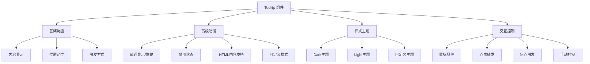
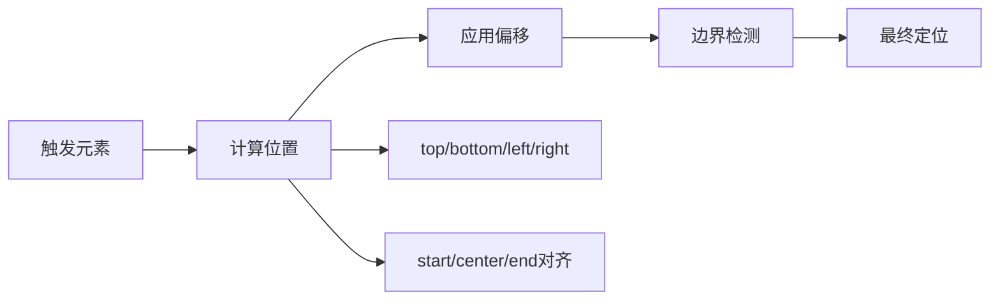
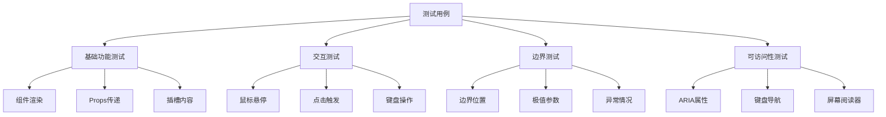

# Tooltip 组件开发计划

## 项目概述

基于现有的 CCUI 项目代码规范，参考 Element Plus Tooltip 组件的实现，完善 Tooltip 组件的功能实现、样式设计、测试用例和文档。

## 技术架构分析

### 现有项目结构

- 使用 Vue 3 + TypeScript + JSX
- 组件采用 `defineComponent` + `setup` 函数式组件
- 使用 `useNamespace` hook 生成 BEM 规范的 CSS 类名
- 组件 props 通过 `ExtractPropTypes` 定义类型
- 测试使用 Vitest + Vue Test Utils

### Tooltip 组件核心功能需求

基于 Element Plus Tooltip 组件分析，需要实现以下核心功能：



## 组件设计规范

### Props 设计

```typescript
interface TooltipProps {
  // 基础属性
  content: string // 提示内容
  placement: TooltipPlacement // 位置：top/bottom/left/right + start/end
  effect: 'dark' | 'light' // 主题效果

  // 显示控制
  visible?: boolean // 手动控制显示状态
  disabled: boolean // 是否禁用
  showArrow: boolean // 是否显示箭头

  // 交互控制
  trigger: 'hover' | 'click' | 'focus' | 'manual' // 触发方式
  showAfter: number // 延迟显示时间(ms)
  hideAfter: number // 延迟隐藏时间(ms)

  // 样式定制
  popperClass?: string // 自定义弹出层类名
  offset: number // 偏移距离

  // 高级功能
  rawContent: boolean // 是否支持HTML内容
  enterable: boolean // 鼠标是否可进入tooltip
}
```

### 事件设计

```typescript
interface TooltipEmits {
  'before-show': () => void // 显示前触发
  'show': () => void // 显示后触发
  'before-hide': () => void // 隐藏前触发
  'hide': () => void // 隐藏后触发
  'update:visible': (visible: boolean) => void // v-model支持
}
```

## 实现方案

### 1. 组件核心逻辑实现

#### 位置计算系统



#### 状态管理

- 使用 `ref` 管理显示状态
- 使用 `computed` 计算样式类名
- 使用 `watch` 监听 props 变化

#### 事件处理

- 鼠标事件：mouseenter/mouseleave
- 点击事件：click
- 焦点事件：focus/blur
- 键盘事件：keydown/keyup

### 2. 样式系统设计

#### BEM 类名规范

```scss
.ccui-tooltip {
  // 触发器容器
  &__trigger {
    display: inline-block;
  }

  // 弹出层
  &__popper {
    position: absolute;
    z-index: 2000;

    // 主题变体
    &--dark {
      background: #303133;
      color: #fff;
    }

    &--light {
      background: #fff;
      color: #303133;
      border: 1px solid #e4e7ed;
    }
  }

  // 箭头
  &__arrow {
    position: absolute;

    // 位置变体
    &--top {
      /* 箭头在上方 */
    }
    &--bottom {
      /* 箭头在下方 */
    }
    &--left {
      /* 箭头在左侧 */
    }
    &--right {
      /* 箭头在右侧 */
    }
  }

  // 内容区域
  &__content {
    padding: 10px;
    font-size: 12px;
    line-height: 1.2;
  }
}
```

#### 动画效果

```scss
.ccui-tooltip-fade-enter-active,
.ccui-tooltip-fade-leave-active {
  transition: opacity 0.15s;
}

.ccui-tooltip-fade-enter-from,
.ccui-tooltip-fade-leave-to {
  opacity: 0;
}
```

### 3. 测试策略

#### 单元测试覆盖



#### 测试用例设计

1. **基础渲染测试**
   - 组件正常挂载
   - 默认 props 生效
   - 插槽内容正确显示

2. **交互功能测试**
   - 鼠标悬停显示/隐藏
   - 点击触发显示/隐藏
   - 延迟显示/隐藏时间
   - 禁用状态测试

3. **位置定位测试**
   - 9种位置正确显示
   - 边界自动调整
   - 偏移量计算

4. **主题样式测试**
   - dark/light 主题切换
   - 自定义样式应用
   - 箭头显示/隐藏

### 4. 文档完善

#### API 文档结构

```markdown
# Tooltip 文字提示

常用于展示鼠标 hover 时的提示信息。

## 何时使用

- 鼠标移入则显示提示，移出消失，气泡浮层不承载复杂文本和操作
- 可用来代替系统默认的 title 提示，提供一个更好的用户体验

## 基本用法

:::demo 基础的、简洁的文字提示气泡框

## 不同位置

:::demo Tooltip 组件提供了12个不同的方向显示Tooltip

## 主题

:::demo Tooltip 组件内置了两个主题：dark和light

## 更多内容

:::demo 展示多行文本或者是设置文本内容的格式

## 高级扩展

:::demo 自定义过渡动画、延迟时间等高级功能
```

#### 示例代码

每个功能点提供完整的 Vue 示例代码，包括：

- Template 使用方式
- Script 配置选项
- Style 样式定制

## 开发里程碑

### 阶段一：核心功能实现

1. **Props 类型定义** - 完善 `tooltip-types.ts`
2. **基础组件结构** - 实现 `tooltip.tsx` 核心逻辑
3. **位置计算系统** - 实现 12 种位置的定位算法
4. **事件处理机制** - 实现各种触发方式

### 阶段二：样式和主题

1. **基础样式** - 完善 `tooltip.scss`
2. **主题系统** - 实现 dark/light 主题
3. **动画效果** - 添加过渡动画
4. **响应式适配** - 确保各尺寸设备兼容

### 阶段三：测试和文档

1. **单元测试** - 完善 `tooltip.test.ts`
2. **集成测试** - 测试与其他组件的交互
3. **文档示例** - 完善 `index.md` 文档
4. **可访问性** - 确保符合 WCAG 标准

### 阶段四：优化和发布

1. **性能优化** - 减少重复计算，优化渲染
2. **边界处理** - 处理各种边界情况
3. **代码审查** - 确保代码质量
4. **版本发布** - 更新组件状态为 100%

## 质量保证

### 代码规范

- 遵循项目现有的 TypeScript 规范
- 使用 ESLint 和 Prettier 格式化
- 组件命名遵循 BEM 规范
- 注释覆盖率达到 80% 以上

### 测试覆盖率

- 单元测试覆盖率 > 90%
- 集成测试覆盖主要使用场景
- 端到端测试验证用户交互流程

### 性能指标

- 组件初始化时间 < 10ms
- 位置计算时间 < 5ms
- 内存占用优化，避免内存泄漏

### 兼容性

- 支持 Vue 3.x
- 支持现代浏览器 (Chrome 90+, Firefox 88+, Safari 14+)
- 支持移动端触摸交互

## 风险评估

### 技术风险

- **位置计算复杂性**: 需要处理各种边界情况和滚动容器
- **事件处理冲突**: 可能与其他组件的事件处理产生冲突
- **性能问题**: 频繁的位置计算可能影响性能

### 解决方案

- 使用成熟的定位算法库或参考 Element Plus 实现
- 建立完善的事件委托和清理机制
- 实现防抖和节流优化性能

## 验收标准

### 功能完整性

- [ ] 支持 12 种位置定位
- [ ] 支持 4 种触发方式
- [ ] 支持 dark/light 主题
- [ ] 支持延迟显示/隐藏
- [ ] 支持禁用状态
- [ ] 支持 HTML 内容
- [ ] 支持自定义样式

### 代码质量

- [ ] TypeScript 类型完整
- [ ] 单元测试覆盖率 > 90%
- [ ] 代码审查通过
- [ ] 性能测试通过

### 用户体验

- [ ] 交互流畅自然
- [ ] 视觉效果美观
- [ ] 可访问性良好
- [ ] 文档清晰完整

### 项目集成

- [ ] 与现有组件库风格一致
- [ ] 构建和打包正常
- [ ] 在示例项目中正常运行
- [ ] 组件状态更新为 100%
